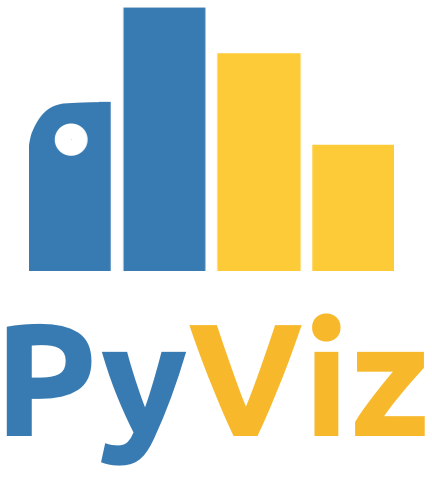

<br>

# Python tools for data visualization

|    |    |
| --- | --- |
| Build Status | [](https://github.com/pyviz/pyviz.org/actions) |
| Website | [](https://github.com/pyviz/pyviz.org/tree/gh-pages) [](https://pyviz.org) |

Source material to build [pyviz.org](https://pyviz.org).  This site is owned by [NumFocus](https://numfocus.org) and is currently managed by Anaconda, Inc. for the community, but is open to everyone involved in Python data visualization; see [#2](https://github.com/pyviz/website/issues/2).

## Building pyviz.org

A GitHub Actions job builds pyviz.org on every push to master, every Monday (to refresh the badges), and on demand. It deploys the site to the `gh-pages` branch and stores the badges on the `cache` branch.

Pull requests are built too but never deployed: download the `site` artifact from the workflow run summary to preview the result.

## Building website locally

Install [uv](https://docs.astral.sh/uv/), then the dependencies:

```bash
uv sync
```

Optionally, seed the badges with the ones last built by CI. Badges that fail to be fetched locally then fall back to these where possible:

```bash
git fetch origin cache && git archive origin/cache doc/_static/cache | tar x
```

Build the badges (pass e.g. `--kinds stars,conda_downloads` to only build some of them):

```bash
uv run python tools/build_badges.py
```

Build the website:

```bash
uv run sphinx-build -b html doc builtdocs
```

View the website locally:

```bash
uv run python -m http.server -d builtdocs
```

Lint the code:

```bash
uv run ruff check
uv run ruff format --check
```

## Adding a tool to the "All Tools" page

See the [README](tools/README.md) in the tools directory for instructions on adding a tool to the "All Tools" page.
